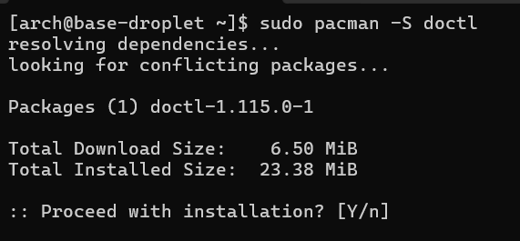
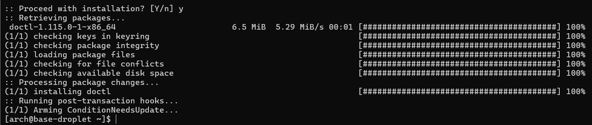

git@github.com:fountum/acit-2420-assignment-1.git# acit-2420-assignment-1

Assignment 1 for ACIT 2420

  
- [Introduction](#Introduction)
- [Installing and Configuring doctl](#installing-and-configuring-doctl)
- [Creating SSH Key Pair](#Creating-SSH-Key-Pair)
- [Adding a Public Key to your DigitalOcean Account](#adding-a-public-key-to-your-digitalocean-account)
- [Adding an Arch Linux Image to DigitalOcean](#adding-an-arch-linux-image-to-digitalocean)
- [Creating a cloud-init YAML configuration](#creating-a-cloud-int-yaml-configuration)
- [Creating a Droplet](#Creating-a-Droplet)
- [Connecting to Droplet](#connecting-to-droplet)
- [Verifying Configuration](#verifying-configuration)
- [External Resources](#External-Resources)
- [Citations](#Citations)


# Introduction

This tutorial will teach you how to create Arch Linux based virtual machines on DigitalOcean with the `doctl` command line interface. No knowledge of DigitalOcean, `doctl` or cloud-init is needed to understand this guide. Most of the steps in this guide will be done using a terminal.

# What is `doctl`?

`doctl` is a command line interface that allows you to manage your DigitalOcean resources using a terminal. It's capable of most of the fucntionality available on the DigitalOcean web UI. 

# Downloading and Installing `doctl`

Depending on your operating system (OS), there are several ways to download `doctl`. This guide will use commands that work in Arch Linux. If you are using a different OS, check [DigitalOcean's installation documentation](https://docs.digitalocean.com/reference/doctl/how-to/install/#step-1-install-doctl).

>[!NOTE]
>Before installing packages it is recommended to use the command `pacman -Syu`. This command will synchronizes (install) packages, synchronizes the package database (which contains metadata about packages), and update all system packages. 

`doctl` is available on the Arch Linux package repository, so the `pacman` utility can be used to install it:
```sudo pacman -S doctl```

Explanation:
- `sudo` temporarily gives a non-root user root privleges, or administrative permissions. Because we are installing packages, we must use `sudo` before `pacman`.  
  - However, this command only works if you have sufficient privileges.
  - `sudo` is used instead of staying logged in as the root user to prevent damaging the system. Logging in as the root user increases the chances of typos or bugs that can harm the system.
- `pacman` is the package manager on Arch Linux. A package manager is a program that can install, update, and remove software packages.  
  - `-S` tells `pacman` to synchronize packages on the machine with the package repository. In other words, this flag will install and update software.

After using this command, the console will show
- the package and dependencies to be installed
- download and installed size
- prompt to confirm download



Confirm that you are installing the correct packages and confirm the download (type `y` and press enter). A successful installation gives the following output:



# Generating a DigitalOcean API token

To allow `doctl` to access your DigitalOcean account, an API token must be generated. API tokens are string that authenticates programs to access the API of another program.

1. Log in to your DigitalOcean control panel and navigate to the [Application and API page](https://cloud.digitalocean.com/account/api/tokens)

2. Click *Generate New Token*
3. Type in a name for the token. Then click *Full Access* under Scopes.


>[!NOTE] 
> *Token scopes cannot be modified after creation*
> Enabling *Full Access* with this key will allow programs with the API token to perform create, read, update, and delete (CRUD) operations on your DigitalOcean. To restrict what is actions are possible, select *Custom Scope* instead of *Full Access*. 
> As a security measure, the token will be deleted after 90 days by default. This can be changed to less or more time, but it's recommended to have tokens expire for security purposes.

4. Click *Generate Token* at the bottom of the page. 

5. Copy the token and save it in a text file. The token will only be shown to you once, so don't skip this step.

>[!WARNING]
> Do not share this token with anyone. Possessing and API token will give them access to your DigitalOcean droplets. 


Once you've copied and saved your API token, you've completed this step.

# Adding Your API Token to doctl

Adding the API Token to `doctl` will allow you to use `doctl` to make changes to your droplets.

1. Enter this command into the terminal: 
```doctl auth init```
- This command used to give doctl permission access your DigitalOcean account within the scope of the API token 

After using the command, you will be prompted to enter in your API token. 

2. Paste in your API token and press enter. `doctl` will begin validating your token.

3. Verify that you correctly added the token, get your account details using the following command:
```doctl account get```
- This command will try to get your account details.


If the command successfully prints your account information, you've successfully added you API token to `doctl`.

### External References
https://docs.digitalocean.com/reference/doctl/how-to/install/

# Creating an SSH Key Pair

> What is Secure Shell (SSH)?
> Secure Shell (SSH) is a protocol that allows for data to sent securely over unsecure networks. SSH is used to remotely connect to servers and issue commands. It uses public key cryptography to encrypt and decrypt data, as well as authenticate users. At a high level, the protocol works like this in the context of remote servers:
> - An SSH key pair is generated, resulting in one *public key* and *private key*
>   - Public keys are used to encrypt data; this is given to the server
>   - Private keys are used to decrypt data; this is kept by the user/client
>   - The keys themselves are put in a cryptography algorithm with data to produces what looks like random data but is actually a very specific output from the key + data  
>   - Only the corresponding key pairs work with each other
> - When establishing a connection to the serve, the client provides the private key to authenticate themself
> - When sending data, the server will use the public key to encrypt the data, which can only be decrypted using the private key
>   - This prevents 'man-in-the-middle' attacks as attackers will not beable to view the contents of the data if they get a hold of it

To generate an SSH key pair, the utility `ssh-keygen` can be using in the terminal on Windows,MacOs, or Linux systems.

```ssh-keygen -t <ENCRYPTION> -f <PATH> -C <COMMENT>```
Command Explanation:
- `-t` Type of encryption used to generate the key. We will use `ed25519` in this example.
- `-f` Path where the key is created and name of key. This should be the `.ssh` directory in your home directory.
  - `~/.ssh` on Linux
  - `C:\Users\<USERNAME>\.ssh` on Windows
- `-C` An optional comment that's appended on to the end of the public key. Usually contact information of the key holder.

Example Arch Linux command:
```ssh-keygen -t ed25519 -f ~/.ssh/demo-key -C '<email>'```

After entering the command, you will be prompted to enter a passphrase. While this provides more security, a passpharse-less SSH key will still be more secure than using only password.


After you've generated the SSH keys, check the path where you've created the keys. Two files with the name you've specified will be there. The file ending in `.pub` is the public key. The file with no extension is the private key. 


# Adding a Public Key to your DigitalOcean Account 
As previously mentioned, a key element of SSH is giving the server the public key to encrypt data. The server in our scenario is our DigitalOcean droplet. In this step we will add the SSH public key we generated to our DigitalOcean account.

1. Copy the contents of the public key file.
2. Use the following command to add the public key to your account:
```doctl compute ssh-key create <KEY-NAME> --public-key <PUB-KEY>``` 
- `<KEY-NAME>` The name you want to give the key, such as 'ACIT-2420'. This is only to help you identify the key.
- `<PUB-KEY>` The contents of the public key file. Your key will have spaces in it, so use quotes.


The terminal will output ID, name, and fingerprint of the key. Your SSH public key was successfully added.


### External Resources
https://docs.digitalocean.com/reference/doctl/reference/compute/ssh-key/

# Adding an Arch Linux Image to DigitalOcean
DigitalOcean hosts a number of pre-configured images for Debain, Ubuntu, and CentOS. To use Arch Linux in DigitalOcean droplets,  we will have to import an image manually.

1. Find the latest version of Arch Linux cloud image that contains `cloudimg` and ends with `.qcow2` in the [Arch Linux Package Registry](https://gitlab.archlinux.org/archlinux/arch-boxes/-/packages/)

>[!NOTE] 
> This Arch Linux image is known as a *cloud image*. Cloud images are pre-configured versions of operating systems intended for cloud infrastructure. They come with settings and software like cloud-init to make creating cloud instances more effecient.


2. Right click the file name and choose *Copy Link* in the context menu
3. In the terminal, use the following command to list DigitalOcean regions: 
```doctl compute region list```
- Regions refers to where DigitalOcean has data centers that host the droplets.

4. Choose a region that is closest geographically and remember its corresponding slug. In this guide we will use `SFO3` 
5. To import your image to DigitalOcean, use the following command:
```doctl compute image create <IMAGE-NAME> --image-url <URL> --region <REGION>```
- `<IMAGE-NAME>` The name you want to give this image on DigitalOcean.
- `<URL>` URL of the Arch Linux cloud image you copied
- `<REGION>` Slug of the region you want to use 

Example usage:
```doctl compute image create arch-linux-cloud-image --image-url https://gitlab.archlinux.org/archlinux/arch-boxes/-/package_files/7529/download --region sfo3```


DigitalOcean will take a few moments to import the image. 

# Creating a cloud-init configuration

> What is cloud-init?
> Cloud-init is a package used to quickly set up and configure systems, VMs, or cloud-based servers. Using a configuration file created by the user, cloud-init will apply those settings to the system without additional manual input. It comes pre-packaged with most cloud images of operating systems, including the cloud image of Arch Linux we are using. 

In this step we will create a YAML file to pass to cloud-init when we create our Droplet.

There are many configuration options available using cloud-init. In this guide we will use cloud-init to:
- Add users
- Install packages
- Disable logging in as root via SSH

1. Create a file titled `config.yml`
2. Open the file in a text editor
3. Fill in the missing data in the following code block and copy it into the `config.yml`:

```
#cloud-config
users:
  - name: <USER-NAME>
    primary_group: <GROUP>
    gecos: <COMMENT>
    groups: wheel
    sudo: ["ALL=(ALL) NOPASSWD: ALL"]
    shell: /bin/bash
    ssh-authorized-keys:
      - <public-key>   

packages:
  - neovim
  - less
  - bash-completion
  - man-db
  - git

disable_root: true
```
Explanation
- `#cloud-config` Header *required* at the start of file. Cloud-init will not recongnize the file as cloud config data if omitted.
    - citation : https://cloudinit.readthedocs.io/en/latest/explanation/format.html#headers-and-content-types
- `users` defines users and their properties
  - `name`: user's name. You will use this to connect to the droplet 
  - `primary_group`: group that Arch Linux will assign the files created by this user.
  - `gecos`: optional comment.
  - `group`: groups users is member of. `wheel` is an admin group given to users to perform administrative actions
  - `sudo`: user's sudo privileges. 
    - First `ALL` specifies what hosts commands can be ran on
    - Second `(ALL)` specifies what users commands can be run as
    - `NOPASSWD:` enables the use of sudo without a password
    - Third `ALL` allows all commands to be used
  - `ssh-authorized-keys`: SSH public keys whose corresponding private keys are allow to log in as this user.
- `packages`: Packages that will automatically installed on initialization.
- `disable_root`: If set to true, disables logging as the root user using SSH
  - Every Linux distribution has a root user named `root`, which has unlimited privileges
  - Attackers can much better odds of bruteforcing a password for `root` than both a username and password
  - Disabling root log in prevents this vulnerability
  - NOTE: it's still possible to log in as the root user after connection is established

Once you've created this file, you're ready to create a droplet.

  https://wiki.archlinux.org/title/Sudo#Disable_root_login
- ref: https://wiki.archlinux.org/title/Users_and_groups#User_groups


https://wiki.archlinux.org/title/Users_and_groups


# Creating a Droplet

With an SSH key pair generated, an Arch Linux cloud image imported, and a cloud-init YAML file created, we are ready to create a DigitalOcean droplet.

1. Choose a droplet size (VM specs) from the size list: 
```doctl compute size list```
- This command lists all the virtual machine specs available on DigitalOcean. 
- In this guide, we will use `s-1vcpu-512mb-10gb`.

2. To create a droplet, use the command
```doctl compute droplet create <DROPLET-NAME> --image <IMAGAE> --size <SIZE> --region <REGION> --user-data-file <PATH> --ssh-keys <SSH-KEY> --wait```
- `--image <IMAGE-NAME>` ID of image to be installed on the droplet, specified in [Adding an Arch Linux Image to DigitalOcean](#adding-an-arch-linux-image-to-digitalocean)
- `--size <SIZE>` Droplet size
- `--region <REGION>` What server the droplet is created on. 
- `--user-data-file <FILEPATH>` configured cloud-init YAML file from [Creating a Cloud-Init YAML Configuration](#creating-a-cloud-init-yaml-configuration) to be exectued on the when creating the droplet
- `--ssh-keys <SSH-KEY>` fignerprint of public key on DigitalOcean. See [Adding a Public Key to your DigitalOcean Account](#adding-a-public-key-to-your-digitalocean-account)
- `--wait` prevents user from using the terminal before the droplet is finished initializing

> [!NOTE]
> If you forget any of the names or IDs for the options above use the following command to see what is available on DigitalOcean:
> ```doctl compute <ITEM> list```
> Substitute `<ITEM>` with `size`, `region`, `image`, or `ssh-key`


After using this command, the terminal will stop receiving your inputs until the droplet is finished initializing, how ever you may still have to wait for a few more moments before connecting to the droplet.

### External Resources
https://docs.digitalocean.com/reference/doctl/reference/compute/droplet/

# Connecting to Droplet

Once your droplet is created, you can remotely connect to it using `SSH` in your terminal.

1. Copy the public IP of your droplet. If it no longer visible, use the following command to get it:
````doctl compute droplet get <DROPLET-NAME> --format PublicIPv4```

2. To connect to the Droplet, type in the following command:
`ssh -i <PRIVATE-KEY> <USERNAME>@<IP>`
- `<PRIVATE-KEY>` Filepath of the corresponding private key. If you've followed this guide, it should be located in the `~/.ssh` directory.
- `<USERNAME>` User name defined in cloud-init YAML file
- `<IP>` The public IP of the droplet

3. When you connect to a system for the first time, you will be asked if you want to connect. Type and enter `yes`.


If the connection is successful, the hostname on your command line will change to what you nameed your droplet.

# Verifying cloud-init Configuration

Formatting errors in the YAML file can result in your cloud-init configuration not executing properly. Unfortunately, cloud-init won't directly throw errors so we will have to manually check if the configuration was executed. This section will only cover changes made in the YAML script provided. For more information about debugging cloud-init, see [How to debug cloud-init](https://cloudinit.readthedocs.io/en/latest/howto/debugging.html).

## Checking Package Installation
`pacman -Q` queries the local database on the system. In other words it returns a list of every package installed on your system. Combining it with string will find packages that pattern matches that string. If you use `pacman -Q <PACKAGE>` with any package listed in the YAML file, you should see the package listed. If not, cloud-init did not execute the atleast this portion of configuration properly.


https://cloudinit.readthedocs.io/en/latest/howto/debug_user_data.html

# External Resources
(doctl Reference)[https://docs.digitalocean.com/reference/doctl/reference/]

# References
Rudareanu, V., & Baturin, D. (2023). Linux for System Administrators. Packt Publishing. https://learning.oreilly.com/library/view/linux-for-system/9781803247946/
(n.d.). Pacman. Arch Linux Wiki. https://wiki.archlinux.org/title/Pacman#Upgrading_packages
(n.d.). Sudo. Arch Linux Wiki. https://wiki.archlinux.org/title/Sudo
(n.d.). What is SSH? | Secure Shell (SSH) protocol. Cloudflare. https://www.cloudflare.com/learning/access-management/what-is-ssh/
(n.d.). What is asymmetric encryption? Cloudflare. https://www.cloudflare.com/learning/ssl/what-is-asymmetric-encryption/
(n.d.). How does public key cryptography work? Cloudflare. https://www.cloudflare.com/learning/ssl/how-does-public-key-encryption-work/